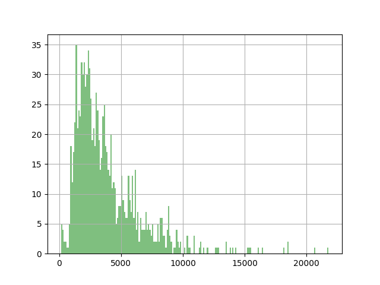

## **Mobile Genetic Elements Retrieving Tool** - **MGERT**

*MGERT* is a computational pipeline for easy retrieving of MGE's coding sequences of a particular family from genome assemblies.
*MGERT* utilizes several established bioinformatic tools combined into single pipeline which hides different technical quirks from an inexperienced user.

### Requirements


- [RepeatModeler 1.0.11 ](http://www.repeatmasker.org/RepeatModeler/)
- [RepeatMasker  open-4.0.7](http://www.repeatmasker.org/RMDownload.html)
- [bedtools v2.27.0](http://bedtools.readthedocs.io/en/latest/)
- [RPS-blast v2.7.1+](https://www.ncbi.nlm.nih.gov/Structure/cdd/cdd_help.shtml#RPSBFtp)
- [ORFinder v0.4.1](ftp://ftp.ncbi.nlm.nih.gov/genomes/TOOLS/ORFfinder/linux-i64/)
- awk

- [Python](https://www.python.org/) 3.5 or higher
- Python libraries:
    - pandas v0.21.0
    - matplotlib v2.1.0
    - Biopython v1.70

### Short description

The pipeline includes five steps:
1. *de novo* search for all MGEs in the genome assembly with *RepeatModeler*. 
This step results in a set of consensus sequences for every MGE class/family found (in *fasta* format).
Note, that the classification of the consensuses is made by the REPET package (as the part of RepeatModeler pipeline), and you can retrieve only those MGEs that were classified.
2. collecting particular consensuses and search for their matches in the genome assembly (using *RepeatMasker*).
3. excising of found matches from the genome assembly according to coordinates in the annotation table from previous step.
4. search only for those sequences that contain Conserved Domains (CD), Open Reading Frame (ORF) and CD within this ORF (via successive runs of RPS-blast and ORFinder)
5. adding flanking regions to each sequence with the CD-encoding ORF.

You may run the pipeline from any of these steps, for instance, if you have your own MGEs library to search in the genome.
During the steps 3 & 4 the pipeline creates several diagnostic plots and calculates descriptive statistics on the found sequences (number, mean length, sd, median length, 25th and 75th length percentiles).

### Usage examples


#### Preparation steps

   - First, run configuration script with the following command:

```
./MGERT.py --configure
```
This command will create a configuration file *config.json* with all the necessary paths (see "Requirements" section) and filenames MGERT uses. MGERT will try to find all the paths automatically. Unless it couldn't find them, it will prompt a user to enter a path or a filename.


   - Second, make your local Conserved Domain Database (CDD): put [PSSM](https://www.ncbi.nlm.nih.gov/Structure/cdd/cdd_help.shtml#CD_PSSM) files (with *\*smp* extension) to your working directory along with a CSV file specifying file - domain correspondence, and run MGERT with the following flag:

```
./MGERT.py --make-cdd
```
This command will create a directory *LocalCDD* with all the necessary files inside it and the path to this CDD will be added to the *config.json*.

Now you can run the pipeline.

Below you can see an example of file-domain correspondence table (no header)

|               |    |
|---------------|----|
|  cd00304.smp  | RT |
|  cd01648.smp  | RT |
| pfam00078.smp | RT |
| pfam07727.smp | RT |
| pfam13966.smp | RT |
|  cd01644.smp  | RT |
|  cd01709.smp  | RT |
|  cd10442.smp  | EN |
|  cd00719.smp  | EN |


#### Full pipeline run starting from *de novo* MGE search using RepeatModeler

The shortest way is to run MGERT with  *all-default* parameters (see "Parameters" section):

```
./MGERT.py --mge-type Penelope --assembly genome.fna.gz
```
This command runs search and retrieving of [Penelope](https://www.pnas.org/content/94/1/196) retrotransposons' ORFs and flanking regions in the genome assembly.

#### Pipeline run from an arbitrary step

There are three possible steps to run the pipeline from (except the default one):

- consensus step

Let's consider the situation when you already have a repeat library called, say, `Penelope_consensi.fasta` and you want to find instances of the repeats from the library in your assembly, and therefore there is no need to run *de novo* part of the pipeline. In this case simply type in the following command:

```bash
./MGERT.py -T Penelope  --from-stage cons --lib Penelope_consensi.fasta
```

If consensus library is not specified, it will be automatically generated from the RepeatModeler output

Furthermore, after this step a table with descriptive statistics and a histogram of repeats' lengths will be generated (shown below)

|       |         |
|-------|---------|
| count | 81848.0 |
| mean  | 1380.6  |
| std   | 1987.7  |
| min   | 12.0    |
| 25%   | 152.0   |
| 50%   | 446.0   |
| 75%   | 1945.0  |
| max   | 27686.0 |




- coordinates step

In the case when you have coordinates of repeats' matches (either in RepeatMasker output file format or BED file), you can run MGERT as follows:

```
./MGERT.py -T Penelope --from-stage coords --rm-table Penelope_consensi_matches.rm.out
```

After this step a table with descriptive statistics and a histogram of repeats' lengths will be generated as well.

- ORFs step

Specify fasta file with sequences where to look for conserved domains and run the command:

```
./MGERT.py -T Penelope --from-stage orfs --sequence Penelope_matches_ORFs.fasta
```

After this step a table with descriptive statistics and a histogram of repeats' lengths will be generated as well.

### List of arguments

```
  required arguments:
  -a [genome.fa.gz], --assembly [genome.fa.gz]
                        specify a genome assembly file
  -T [Penelope/BovB/RTE/CR1/L1/LINE etc], --mge-type [Penelope/BovB/RTE/CR1/L1/LINE etc]
                        specify the type of MGE to search

optional arguments:
  -cd [domains.csv], --cd-table [domains.csv]
                        comma delimited file with smp files and their grouping
  -f [cons/coords/orfs/flanks], --from-stage [cons/coords/orfs/flanks]
                        specify the step from which the pipeline should start. 'consensus' - get consensus sequences; 'coords' - get sequences; 'orfs' - get ORFs; flanks - add flanking sequences to CDS.
                        Default 'rmod'
  -k [consensus file], --check-types [consensus file]
                        Print out all the types of MGE found in the RepeatModeler output
  -t [integer], --threads [integer]
                        set number of threads. Default 1
  -C, --censor          use CENSOR for additional classification or not
  -o, --ori             if specified MGERT will use the *.ori file to fetch the coordinates instead of *_rm.out file
  -m M, --merge M       merge all hits within M bp into a single entry. Default 500 bp
  -e [real], --e_value [real]
                        set expectation value (E). Default 0.01
  -c [integer], --start-codon [integer]
                        ORF start codon to use. 0 = 'ATG' only; 1 = 'ATG' and alternative initiation codons; 2 = any sense codon; Default 0
  -l [integer], --min-length [integer]
                        set minimum length of ORF, default 1000 bp
  -s [plus/minus/both], --strand [plus/minus/both]
                        output ORFs on specified strand only. Default 'plus'
  -g [integer], --genetic_code [integer]
                        genetic code to use (1-31, Default 1). See http://www.ncbi.nlm.nih.gov/Taxonomy/Utils/wprintgc.cgi for details.
  -le [500], --left-end [500]
                        length of ORFs' left flanking region. Default 500 bp
  -re [500], --right-end [500]
                        length of ORFs' right flanking region. Default 500 bp
  -L [fasta file], --lib [fasta file]
                        library for RepeatMasker (fasta format). Use with `-f cons` only.
                        When consensus library is not specified it will be automatically composed from RepeatModeler output
  -rm [RepeatMasker table], --rm-table [RepeatMasker table]
                        specify repeat masker table to use, default none. Use with `-f coords` option only
  -sq [sequence.fasta], --sequence [sequence.fasta]
                        specify file name of sequences where to look for domains. Use with `-f orf` option only
  -v, --version         show program's version number and exit

configuration arguments:
  --configure           run the configuration script
  --make-cdd            make local CDD

```